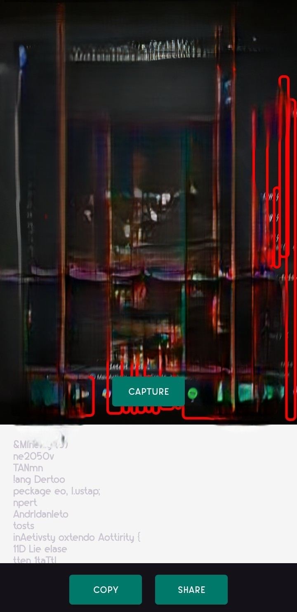
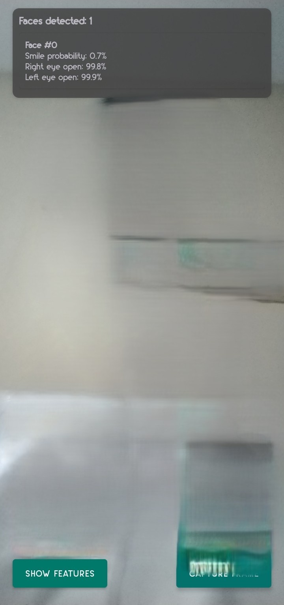
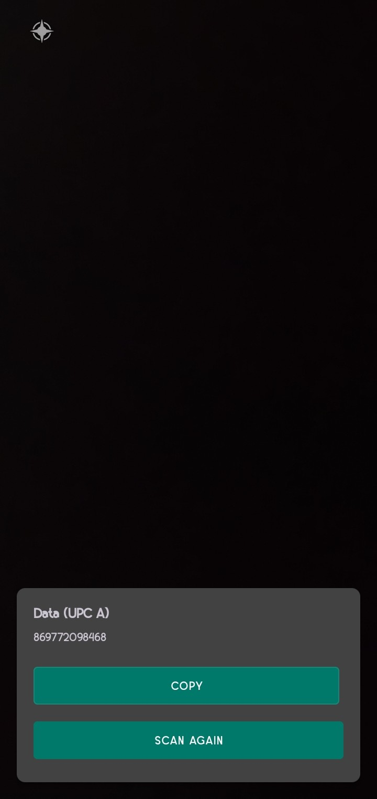
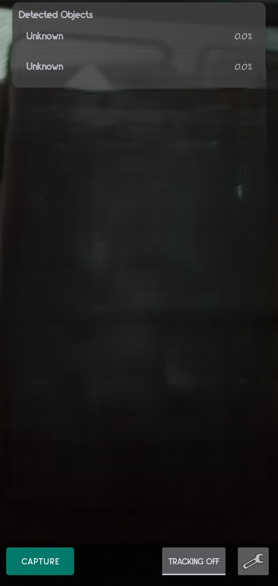

# SnapAI Toolkit Smart Camera App

An Android Studio project built using **Firebase ML Kit** to demonstrate some machine learning features in mobile devices. This app combines four intelligent computer vision tasks with clean UI design and intuitive user interaction.

---

## Installation

1. **Clone this repo** or download the source code:

```bash
git clone https://github.com/Usama-Codez/SnapAI-Toolkit
```

2. Open with Android Studio
File → Open → Select the root folder

3. Connect your Android device or use an emulator.

4. Run the project using ▶️ in Android Studio.

💡 Make sure your Firebase dependencies are synced. Internet access required at first run.

📂 Project Structure
```bash
app/
├── java/
│   └── com.usama.mlkitapp/
│       ├── MainActivity.java
│       ├── OCRActivity.java
│       ├── FaceDetectionActivity.java
│       ├── BarcodeScannerActivity.java
│       └── ObjectDetectionActivity.java
├── res/
│   ├── layout/      # All XML layouts per screen
│   └── drawable/    # Icons and overlays
├── AndroidManifest.xml
build.gradle
```

### Dependencies

```gradle
// Firebase ML Kit modules
implementation 'com.google.mlkit:text-recognition:16.0.0'
implementation 'com.google.mlkit:face-detection:16.1.5'
implementation 'com.google.mlkit:barcode-scanning:17.0.2'
implementation 'com.google.mlkit:object-detection:16.2.5'
```
```gradle
// CameraX
implementation "androidx.camera:camera-camera2:1.1.0"
implementation "androidx.camera:camera-lifecycle:1.1.0"
implementation "androidx.camera:camera-view:1.0.0-alpha32"
```
✅ All models used are on-device for performance and privacy.


## Features

| Feature              | Description                                |
|----------------------|--------------------------------------------|
| 🧾 OCR               | Extract text from images in real time      |
| 😐 Face Detection    | Detect faces and facial landmarks          |
| 🔍 Object Detection  | Detect & track multiple objects on screen  |
| 📦 Barcode Scanner   | Scan QR codes and barcodes instantly       |

---

## Project Stats

- 📱 **Min SDK**: 21  
- ⚙️ **Built with**: Android Studio Electric Eel (or newer)  
- 🔒 **Privacy-first**: 100% on-device ML  
- 📦 **Dependencies**: Firebase ML Kit + CameraX  
- 🧠 **ML Models**: Lightweight, optimized for mobile  

---

## Screenshots

<table>
  <tr>
    <td><strong>OCR</strong></td>
    <td><strong>Face Detection</strong></td>
  </tr>
  <tr>
    <td></td>
    <td></td>
  </tr>
  <tr>
    <td><strong>Barcode Scanner</strong></td>
    <td><strong>Object Detection</strong></td>
  </tr>
  <tr>
    <td></td>
    <td></td>
  </tr>
</table>
---

## 📜 License

This project is part of the **Software for Mobile Devices** course at **FAST NUCES**.  
> For **academic demonstration purposes**.

---

## Developed By

**Usama Akram**  
📫 [LinkedIn](https://linkedin.com/in/usama-codez)  
📫 [GitHub](https://github.com/usama-codez)  

---

## Show Some Love  

If you find this project useful or inspiring, please ⭐ the repo and share it!

---
